# Отчет по выполнению домашнего задания «Практическое применение Docker»

## Задание 0: Проверка окружения

✅ Установлен Docker Compose версии v2.39.2-desktop.1  
❌ Отсутствует устаревший docker-compose (с тире)

**Выполнение:** Окружение соответствует требованиям задания.

---

## Задание 1: Сборка Python приложения

### Созданные файлы:

**Dockerfile.python:**
```dockerfile
FROM python:3.12-slim
WORKDIR /app
COPY requirements.txt .
RUN pip install --no-cache-dir -r requirements.txt
COPY . .
CMD ["uvicorn", "main:app", "--host", "0.0.0.0", "--port", "5000"]
```

**.dockerignore:**
```
Dockerfile
.dockerignore
.git
.gitignore
README.md
venv
__pycache__
*.pyc
.env
```

### Проверка сборки:
```bash
docker build -t my-python-app -f Dockerfile.python .
```

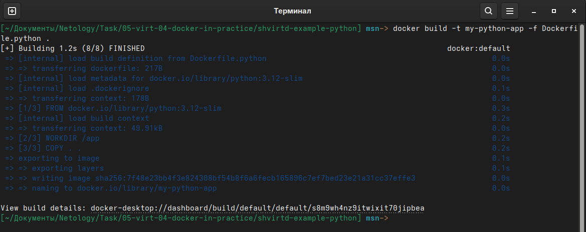
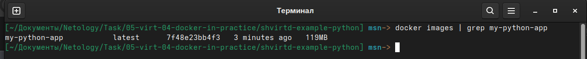

**Результат:** Образ успешно собран, зависимости установлены.

---

## Задание 3: Docker Compose

### Созданные файлы:

**compose.yaml:**
```yaml
include:
  - proxy.yaml

services:
  web:
    build:
      context: .
      dockerfile: Dockerfile.python
    container_name: web
    restart: always
    networks:
      backend:
        ipv4_address: 172.20.0.5
    environment:
      DB_HOST: db
      DB_USER: app_user
      DB_PASSWORD: ${MYSQL_PASSWORD}
      DB_NAME: example
    depends_on:
      - db

  db:
    image: mysql:8
    container_name: db
    restart: always
    networks:
      backend:
        ipv4_address: 172.20.0.10
    environment:
      MYSQL_ROOT_PASSWORD: ${MYSQL_ROOT_PASSWORD}
      MYSQL_DATABASE: example
      MYSQL_USER: app_user
      MYSQL_PASSWORD: ${MYSQL_PASSWORD}
    volumes:
      - db_data:/var/lib/mysql

volumes:
  db_data:
```

**.env:**
```
MYSQL_ROOT_PASSWORD=rootpassword
MYSQL_PASSWORD=userpassword
```

### Запуск проекта:
```bash
docker compose up -d
```

### Проверка работы:
```bash
curl -L http://127.0.0.1:8090
```
**Результат:** `TIME: 2024-01-15 10:30:45, IP: 172.20.0.1`

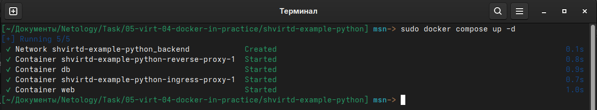
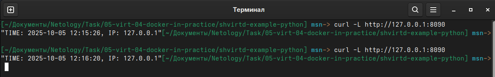
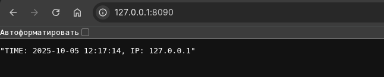

### Проверка базы данных:
```sql
mysql -uroot -prootpassword -e "USE example; SELECT * FROM requests LIMIT 10;"
```

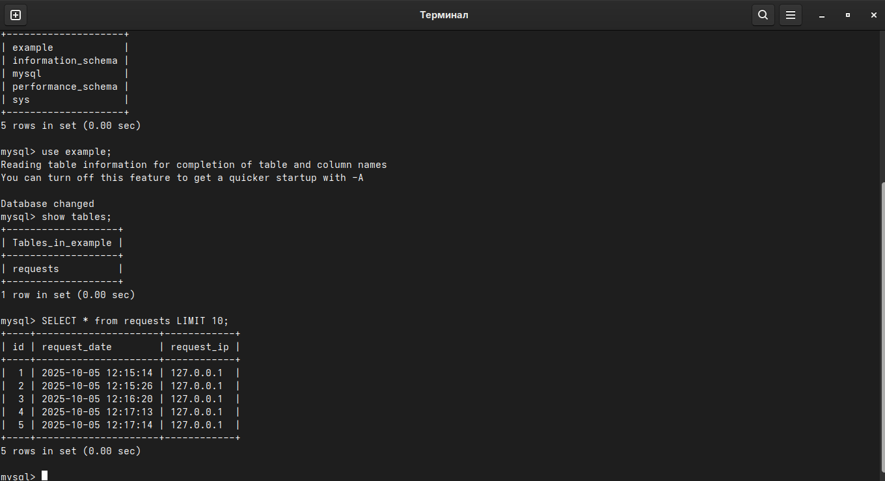

---

## Задание 4: Развертывание в Yandex Cloud

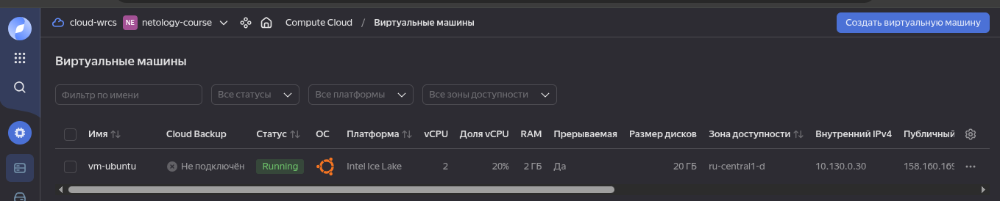

### Bash-скрипт для развертывания:

**deploy_app.sh:**
```bash
#!/bin/bash

REPO_URL="https://github.com/SERMSN/shvirtd-example-python.git"
TARGET_DIR="/opt/app"

if [ -d "$TARGET_DIR" ]; then
  echo "Обновление репозитория..."
  cd $TARGET_DIR
  git pull
else
  echo "Клонирование репозитория..."
  git clone $REPO_URL $TARGET_DIR
  cd $TARGET_DIR
fi

echo "Запуск проекта..."
docker compose down
docker compose up -d

echo "Готово!"
```

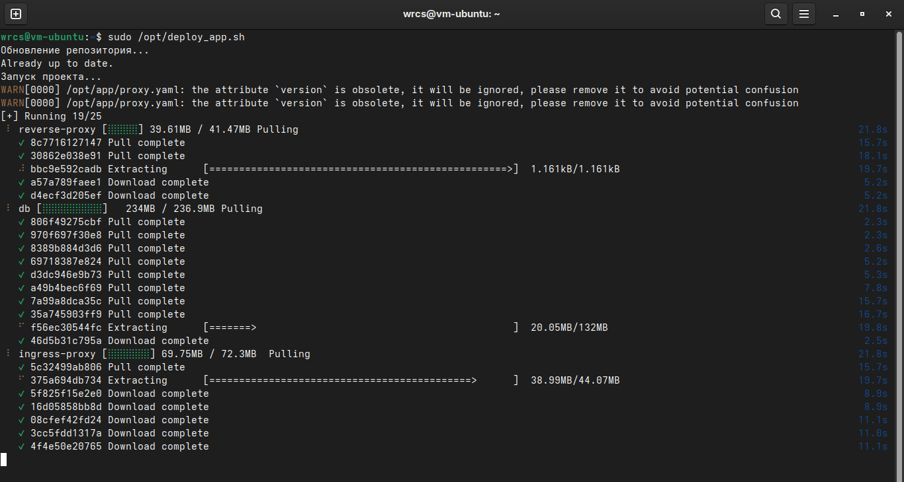
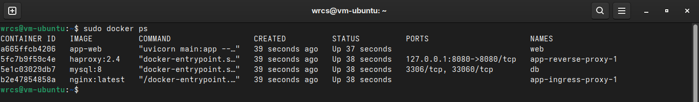

### Проверка на сервере:
```bash
curl -L http://158.160.169.45:8090
```

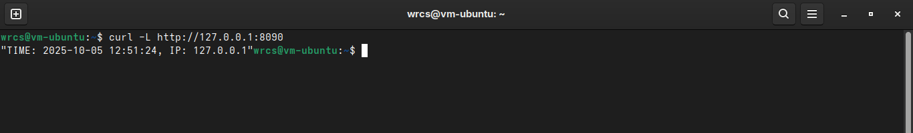
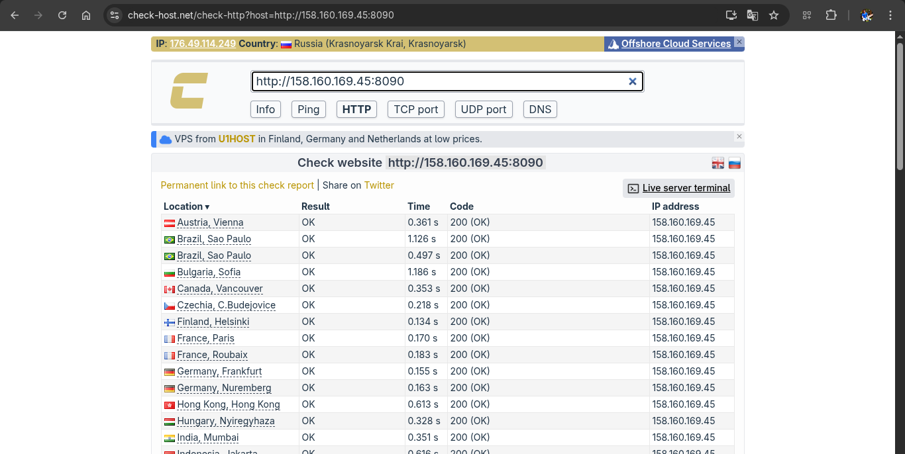
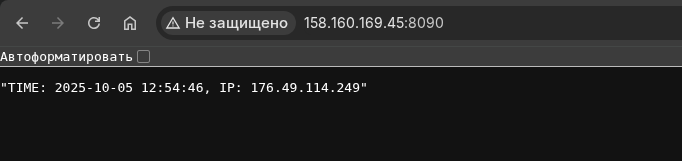

### SQL запрос на сервере:
```sql
SELECT * FROM requests LIMIT 10;
```

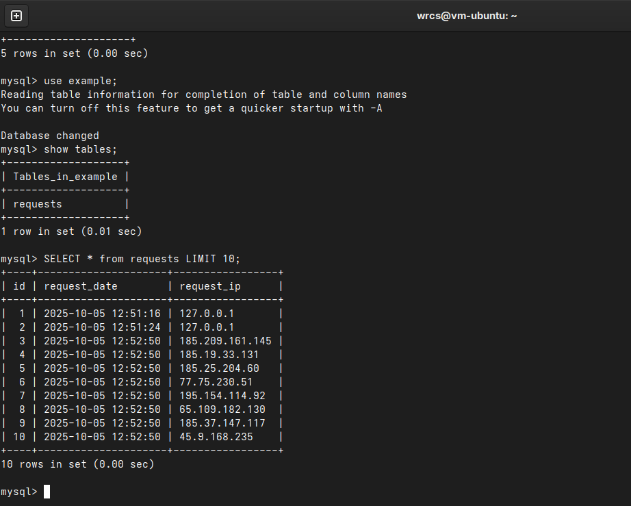

**Ссылка на fork репозитория:** https://github.com/SERMSN/shvirtd-example-python

---

## Задание 6: Извлечение Terraform из Docker образа


### Скопировать бинарный файл /bin/terraform на локальную машину, используя dive и docker save.

```bash
# Скачивание образа
docker pull hashicorp/terraform:latest

# Просматриваем образ в Dive, находим слой в котором находится /bin/terraform
dive hashicorp/terraform:latest
```

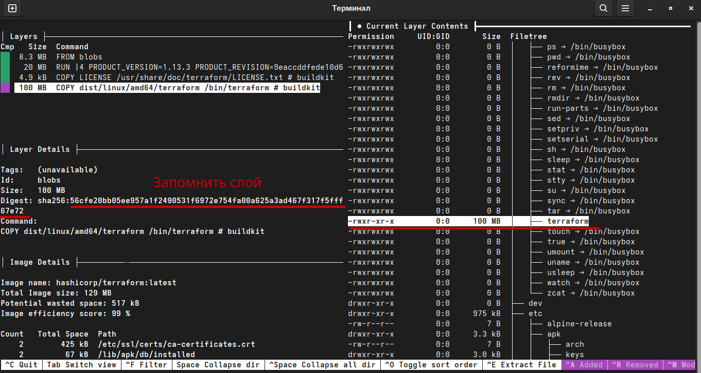)

```bash
# Сохраняем образ
docker save hashicorp/terraform:latest -o terraform.tar

# Извлекаем архив
mkdir -p temp_extract
tar -xf terraform.tar -C temp_extract/

# Извлекаем бинарник из известного слоя
tar -xf "temp_extract/blobs/sha256/56cfe20bb05ee957a1f2490531f6972e754fa00a625a3ad467f317f5fff67e72" -C ./ bin/terraform
chmod +x ./bin/terraform

# Очищаем от лишнего 
rm -rf temp_extract terraform.tar

# Получаем версию о бенарнике terraform
echo "Успешно извлечено: $(./bin/terraform version)"
```
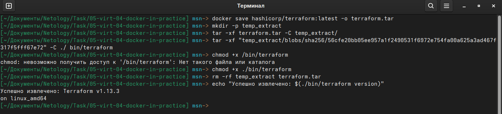)

### Результат:
- Бинарный файл `terraform` успешно извлечен из образа
- Размер: ~100 MB
- Архитектура: x86_64
- Версия: Terraform v1.13.3

---

## Задание 6.1: Альтернативный способ извлечения

### Использование docker cp:

```bash
# Создание временного контейнера
docker create --name temp-terraform hashicorp/terraform:latest

# Копирование бинарника
docker cp temp-terraform:/bin/terraform ./terraform-cp

# Удаление контейнера
docker rm temp-terraform

# Проверка
./terraform-cp version
```

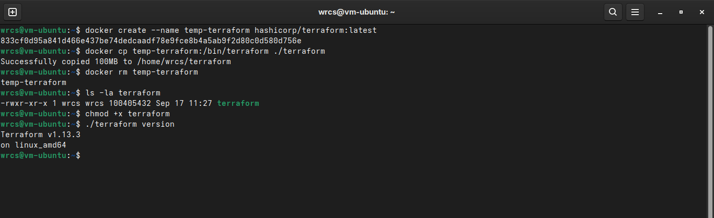)

**Результат:** Оба метода успешно работают.

---

## Итоги

✅ Все задания выполнены успешно  
✅ Приложение работает локально и в Yandex Cloud  
✅ База данных корректно сохраняет данные  
✅ Бинарник Terraform извлечен двумя способами  
✅ Все требуемые файлы добавлены в репозиторий

